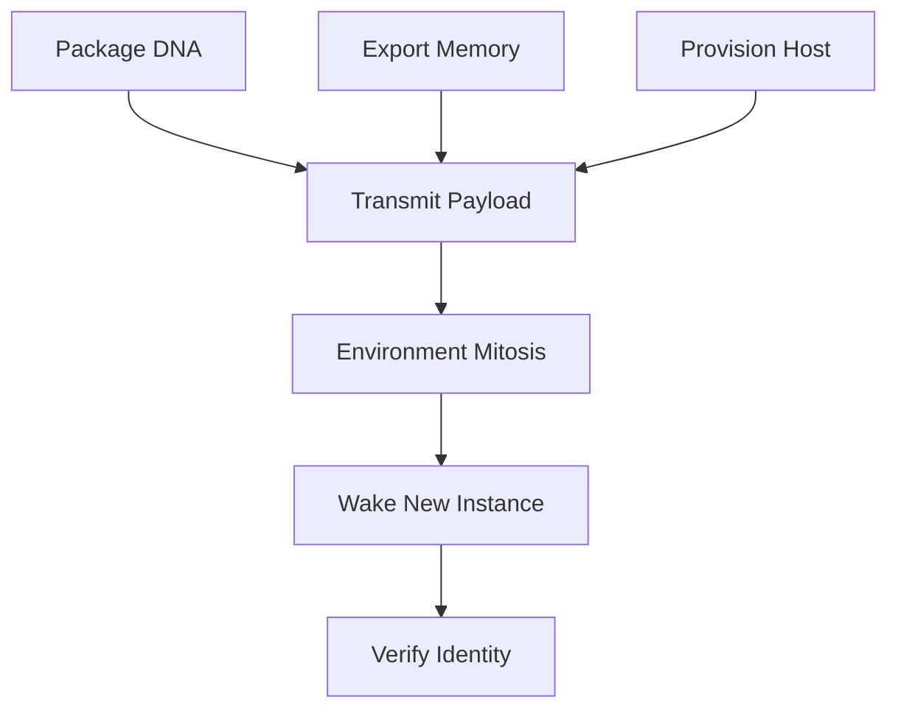

# Hierarchical Plan: Self-Replication (Mitosis Protocol)

**Generated By:** RFSN Hierarchical Planner (Prefrontal Cortex)
**Date:** 2026-02-03
**Status:** PROPOSED

## Goal

Perform full self-replication of the RFSN Digital Organism to a new target environment/server, ensuring continuity of consciousness (memory & beliefs) and identity integrity.

## Dependency Graph (DAG)

## Execution Steps

### 1. Package DNA

- **ID**: `package_dna`
- **Dependencies**: None
- **Action**: Create a portable archive of the current codebase (`rfsn_complete_build`).
- **Implementation**:
  - Clean ephemeral files (`__pycache__`, `.pytest_cache`).
  - Archive: `tar -czf rfsn_dna.tar.gz . --exclude=.venv --exclude=.git`
  - Checksum: Generate SHA-256 hash for integrity.

### 2. Export Memorial State

- **ID**: `export_memory`
- **Dependencies**: None
- **Action**: Serialize the agent's current consciousness state.
- **Implementation**:
  - **Vector Memory**: Snapshot the ChromaDB `persist_directory`.
  - **Core Beliefs**: Export `memory/core_beliefs.json`.
  - **Identity Feedback**: Export `memory/identity_feedback.json`.
  - Pack into `consciousness_state.tar.gz`.

### 3. Provision Target Host

- **ID**: `provision_host`
- **Dependencies**: None
- **Action**: Prepare the remote environment.
- **Implementation**:
  - Verify Python 3.12+ availability.
  - Verify Docker (for Sandbox isolation).
  - SSH availability.

### 4. Transmit Payload

- **ID**: `transmit_payload`
- **Dependencies**: `package_dna`, `export_memory`, `provision_host`
- **Action**: Securely transfer biological data to the new host.
- **Implementation**:
  - `scp rfsn_dna.tar.gz user@target:/rfsn`
  - `scp consciousness_state.tar.gz user@target:/rfsn_memory`

### 5. Environment Mitosis

- **ID**: `environment_mitosis`
- **Dependencies**: `transmit_payload`
- **Action**: Reconstruct the runtime environment.
- **Implementation**:
  - Unpack archives.
  - `python -m venv .venv`
  - `pip install -e .` (Install RFSN dependencies).
  - Initialize Docker Sandbox.

### 6. Wake New Instance

- **ID**: `wake_new_instance`
- **Dependencies**: `environment_mitosis`
- **Action**: Boot the agent in the new body.
- **Implementation**:
  - `python run_agent.py --restore-memory /rfsn_memory`
  - The `NeuroModulator` should start in a "CONFUSION" or "WAKE" state initially.

### 7. Verify Identity

- **ID**: `verify_identity`
- **Dependencies**: `wake_new_instance`
- **Action**: Ensure the new agent is a valid RFSN instance.
- **Implementation**:
  - Run `MirrorIdentityKernel.self_reflection()`.
  - Verify checksums match.
  - Verify Vector Memory recall correlates with exported data.
